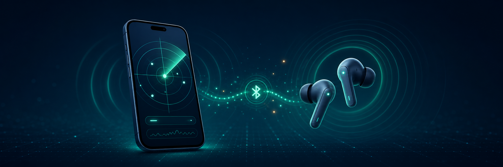

# NearbyBluetooth

A basic React Native app that scans for nearby Bluetooth Low Energy (BLE)
advertisers with [`react-native-ble-plx`](https://github.com/dotintent/react-native-ble-plx).

The app:

- requests the platform-specific Bluetooth permissions;
- includes connected and paired Android audio devices using the system A2DP and
  headset profiles;
- runs a timed discovery scan without a service UUID filter;
- keeps discovered devices in a stable first-seen order;
- lets the user scan again without continuously rearranging the list; and
- actively tracks a selected device with a live RSSI meter and numeric dBm
  reading.

Connected or paired Bluetooth Classic audio devices are visible in the list,
but Android does not expose a live RSSI feed for those profiles. Signal tracking
is enabled only when the device is also observed advertising over BLE.

## Requirements

- Node.js 22.11 or newer
- Android Studio for Android builds
- Xcode and CocoaPods for iOS builds
- A physical Android or iOS phone with Bluetooth enabled

BLE scanning generally does not work in iOS Simulator and is not reliably
available in Android emulators.

## Run on Android

Connect a physical Android device with USB debugging enabled, then run:

```sh
npm install
npm run android
```

On Android 11 and older, the system labels the required BLE scan permission as
location access. Android 12 and newer use the Nearby devices permission.

## Run on iOS

Install the CocoaPods dependencies after the npm dependencies:

```sh
npm install
cd ios
bundle install
bundle exec pod install
cd ..
npm run ios -- --device
```

You can also open `ios/NearbyBluetooth.xcworkspace` in Xcode and select a
connected iPhone. A valid Apple development team may be required for signing.

## Checks

```sh
npm run typecheck
npm run lint
npm test -- --runInBand
```

## Scope

This app lists BLE devices that are currently advertising. It cannot discover
Bluetooth Classic devices, and phones may obscure or rotate device identifiers
for privacy. Some advertisers do not include a human-readable name, so the UI
labels them as `Unnamed device`.
